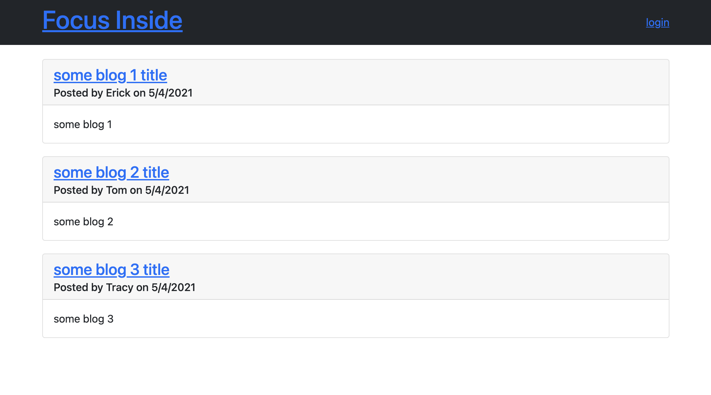

# Tech Blog

## Description

A simple blog site using MVC paradigm in its architectural structure, Handlebars.js as the templating language, Sequelize as the ORM, and the express-session npm package for authentication.

## Uses

JS/Node/Express/MySQL

## Back-end Librarys

sequelize

## Installation Instructions

```
npm install
```

## Usagage Information

```
node server.js
```

## Demo

soon

## Screenshot


